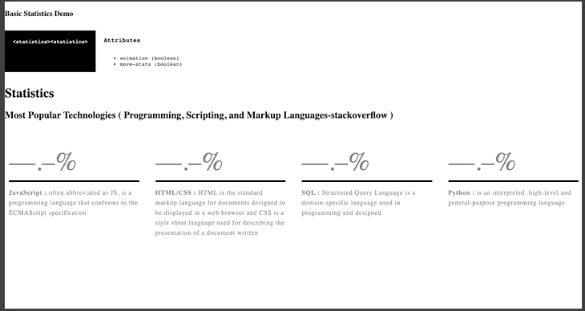
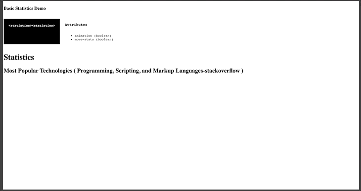

# Statistics-data

Lit-Element web component Statistics-data. This web component displays the statistics that are initially entered with a text.It has two attributes that manage an animation effect : "animation" the stats move like a counter and "move-stats" the stats move up effect. 

## Demo

### Option 1

Show statistics

```
        <statistics-data>
                <div>
                    <p id="number" >67.7%</p>
                    <p id="infoTitle" > JavaScript :</p>
                    <span id="description"> often abbreviated as JS, is a programming language that conforms to the ECMAScript specification</span>
                </div>
                <div>
                    <p id="number" >63.1%</p>
                    <p id="infoTitle" >HTML/CSS :</p>
                    <span id="description"> HTML is the standard markup language for documents designed to be displayed in a web browser and CSS is a style sheet language used for describing the presentation of a document written</span>
                </div>
                <div>
                    <p id="number" >54.7%</p>
                    <p id="infoTitle" >SQL :</p>
                    <span id="description"> Structured Query Language is a domain-specific language used in programming and designed </span>
                </div>
                <div>
                    <p id="number" >44.1%</p>
                    <p id="infoTitle" >Python :</p>
                    <span id="description"> is an interpreted, high-level and general-purpose programming language</span>
                </div>
        </statistics-data>

```
### Option 2

Show stats with counter animation, animation="true".



```
        <statistics-data animation="true">
                <div>
                    <p id="number" >67.7%</p>
                    <p id="infoTitle" > JavaScript :</p>
                    <span id="description"> often abbreviated as JS, is a programming language that conforms to the ECMAScript specification</span>
                </div>
                <div>
                    <p id="number" >63.1%</p>
                    <p id="infoTitle" >HTML/CSS :</p>
                    <span id="description"> HTML is the standard markup language for documents designed to be displayed in a web browser and CSS is a style sheet language used for describing the presentation of a document written</span>
                </div>
                <div>
                    <p id="number" >54.7%</p>
                    <p id="infoTitle" >SQL :</p>
                    <span id="description"> Structured Query Language is a domain-specific language used in programming and designed </span>
                </div>
                <div>
                    <p id="number" >44.1%</p>
                    <p id="infoTitle" >Python :</p>
                    <span id="description"> is an interpreted, high-level and general-purpose programming language</span>
                </div>
        </statistics-data>

```
### Option 3

Show stats with counter animation and animated movement of the set of statistics to the top, animation="true" and move-stats="true"



```
<statistics-data animation="true" move-stats="true">
                <div>
                    <p id="number" >67.7%</p>
                    <p id="infoTitle" > JavaScript :</p>
                    <span id="description"> often abbreviated as JS, is a programming language that conforms to the ECMAScript specification</span>
                </div>
                <div>
                    <p id="number" >63.1%</p>
                    <p id="infoTitle" >HTML/CSS :</p>
                    <span id="description"> HTML is the standard markup language for documents designed to be displayed in a web browser and CSS is a style sheet language used for describing the presentation of a document written</span>
                </div>
                <div>
                    <p id="number" >54.7%</p>
                    <p id="infoTitle" >SQL :</p>
                    <span id="description"> Structured Query Language is a domain-specific language used in programming and designed </span>
                </div>
                <div>
                    <p id="number" >44.1%</p>
                    <p id="infoTitle" >Python :</p>
                    <span id="description"> is an interpreted, high-level and general-purpose programming language</span>
                </div>
        </statistics-data>

```

```html
<statistics-data></statistics-data>

```
## Properties


|      Name       |     Attribute     |  type  |                     Description                         |
|-----------------|-------------------|--------|---------------------------------------------------------|
|   animation     |     animation     | bolean |         animation of numbers/stats as a counter         |
|   moveStats     |     move-stats    | bolean |   the stat move up when viewport is on focus position   |


## CSS Custom Properties


|      Name             |                     Description                         |
|-----------------------|---------------------------------------------------------|
| --line-height-number  | line-height to the number component                     |
| --line-height-text    | line-height to the text component                       |
| --font-size-number    | Font-size to the number component                       |
| --font-size-text      | Font-size to the text component                         |
| --border-color        | border color border-top                                 |
| --component-color     | color base to the component                             |


## CSS Shadow Parts


|      Name       |                     Description                         |
|-----------------|---------------------------------------------------------|
|  stats-number   |      access to the paragraph number CSS/styles tag      |
|  stats-text     |      access to the paragraph text CSS/styles tag        |

## Install the Polymer-CLI

First, make sure you have the [Polymer CLI](https://www.npmjs.com/package/polymer-cli) and npm (packaged with [Node.js](https://nodejs.org)) installed. Run `npm install` to install your element's dependencies, then run `polymer serve` to serve your element locally.

## Viewing Your Element

```
$ npm run start
```
## Running Test
```
$ npm run test
```
## Build
```
$ npm run build
```

## Author
**KairósDS Team**

## License

This project is licensed under the Apache 2.0 License - see the [LICENSE](LICENSE) file for details